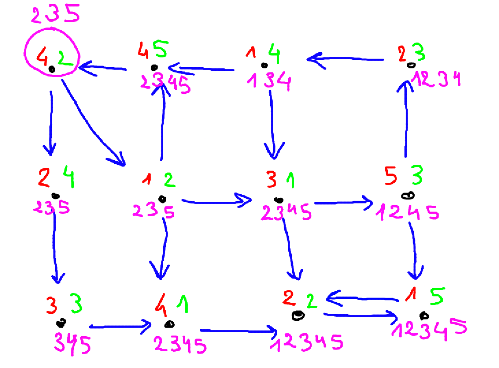

# Railway Cargo Problem

## Algorithm

The idea of the algorithm is to traverse the railway, starting from the start station, 
in a BFS (breadth first search) fashion. We have to keep track of the cargo that can reach
each station, so instead of enqueuing just stations, we enqueue a station with the cargo
that will be available on the path going to that station. Essentially our queue doesn't store 
graph nodes, but the cargo arriving at a particular station.
We keep record of all cargo that has reached a station as our final result. 

To ensure our algorithm terminates, we have to stop enqueuing a state (station & cargo)
if this state has already been visited, or in fact if an encompassing state has already been
visited. By encompassing state here I mean with the same station, but a cargo that is a superset
of the other state. If such a state has already been visited, a subset state will not
bring new information so we can discard it.

The time complexity of my approach can be thought about like this (where C is the number of cargo types, 
S the number of stations and T the number of tracks)
- For each dequeue,  we look at all neighbors, which is bounded by T
- For each neighbor of a dequeue, we perform some O(C) set operations (containsAll, set union...)
- We dequeue each station at most C times, if we happen to visit it with a single different cargo time each time
So overall our time complexity is about O(C².T)

## Example

The below image is a representation of one of the tests I made, that show the unload cargo types in red, 
the load cargo types in green and the cargo types that can reach a particular station in pink.

